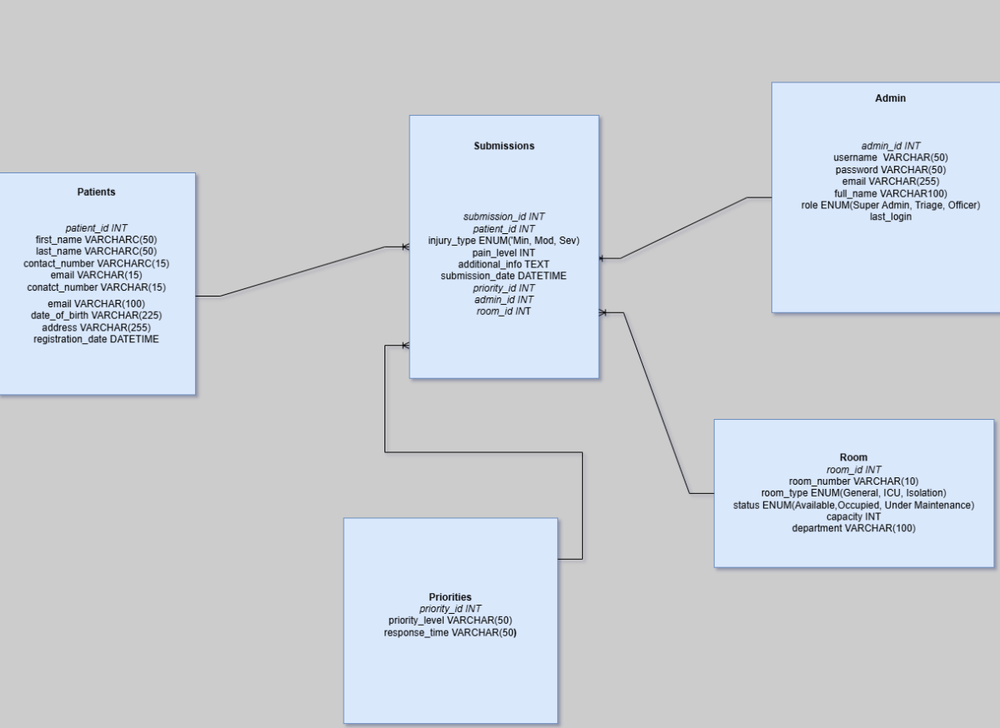

# Hospital Triage App Database Design

## Introduction

The **Hospital Triage App** is developed to streamline the process of assessing and prioritizing patient cases based on the severity of their conditions. This database design ensures efficient management of patient information, administrative operations, and triage submissions.

## Entities and Attributes

### 1. Patients

Stores information about individuals seeking medical attention.

| Attribute Name     | Data Type    | Constraints                | Description                      |
|--------------------|--------------|----------------------------|----------------------------------|
| `patient_id`       | INT          | PRIMARY KEY, AUTO_INCREMENT | Unique identifier for each patient |
| `first_name`       | VARCHAR(50)  | NOT NULL                   | Patient's first name             |
| `last_name`        | VARCHAR(50)  | NOT NULL                   | Patient's last name              |
| `contact_number`   | VARCHAR(15)  | NOT NULL, UNIQUE           | Patient's contact phone number   |
| `email`            | VARCHAR(100) | UNIQUE                     | Patient's email address          |
| `date_of_birth`    | DATE         | NOT NULL                   | Patient's date of birth          |
| `address`          | VARCHAR(255) |                            | Patient's residential address    |
| `registration_date`| DATETIME     | DEFAULT CURRENT_TIMESTAMP  | Registration timestamp           |

### 2. Admins

Contains data about administrative personnel managing submissions.

| Attribute Name | Data Type    | Constraints                | Description                      |
|----------------|--------------|----------------------------|----------------------------------|
| `admin_id`     | INT          | PRIMARY KEY, AUTO_INCREMENT | Unique identifier for each admin  |
| `username`     | VARCHAR(50)  | NOT NULL, UNIQUE           | Admin's login username           |
| `password`     | VARCHAR(255) | NOT NULL                   | Hashed password for security     |
| `email`        | VARCHAR(100) | NOT NULL, UNIQUE           | Admin's email address            |
| `full_name`    | VARCHAR(100) | NOT NULL                   | Admin's full name                |
| `role`         | ENUM         | DEFAULT 'Triage Officer'   | Role within the system           |
| `last_login`   | DATETIME     |                            | Last login timestamp             |

### 3. Submissions

Records triage information submitted by patients.

| Attribute Name   | Data Type    | Constraints                                    | Description                                    |
|------------------|--------------|------------------------------------------------|------------------------------------------------|
| `submission_id`  | INT          | PRIMARY KEY, AUTO_INCREMENT                    | Unique identifier for each submission          |
| `patient_id`     | INT          | FOREIGN KEY REFERENCES Patients(patient_id) NOT NULL | Reference to the submitting patient        |
| `injury_type`    | ENUM         | NOT NULL                                       | Type of injury (Minor, Moderate, Severe)        |
| `pain_level`     | INT          | NOT NULL, CHECK (pain_level BETWEEN 1 AND 10)   | Self-reported pain level (1-10)                 |
| `additional_info`| TEXT         |                                                | Additional patient information                  |
| `submission_date`| DATETIME     | DEFAULT CURRENT_TIMESTAMP                      | Submission timestamp                            |
| `priority_id`    | INT          | FOREIGN KEY REFERENCES Priorities(priority_id)  | Assigned priority level                         |
| `admin_id`       | INT          | FOREIGN KEY REFERENCES Admins(admin_id)         | Admin managing the submission                   |
| `room_id`        | INT          | FOREIGN KEY REFERENCES Rooms(room_id)           | Allocated room for the patient                   |

### 4. Priorities

Defines priority levels for submissions.

| Attribute Name  | Data Type    | Constraints           | Description                              |
|-----------------|--------------|-----------------------|------------------------------------------|
| `priority_id`   | INT          | PRIMARY KEY, AUTO_INCREMENT | Unique identifier for each priority level |
| `priority_level`| VARCHAR(50)  | NOT NULL, UNIQUE      | Description (High, Medium, Low)           |
| `response_time` | VARCHAR(50)  | NOT NULL              | Expected response time for the priority   |

### 5. Rooms

Manages hospital room allocations.

| Attribute Name | Data Type    | Constraints                         | Description                             |
|----------------|--------------|-------------------------------------|-----------------------------------------|
| `room_id`      | INT          | PRIMARY KEY, AUTO_INCREMENT         | Unique identifier for each room         |
| `room_number`  | VARCHAR(10)  | NOT NULL, UNIQUE                    | Room number or identifier               |
| `room_type`    | ENUM         | NOT NULL                            | Type (General, ICU, Isolation)          |
| `status`       | ENUM         | DEFAULT 'Available'                 | Current status (Available, Occupied, Under Maintenance) |
| `capacity`     | INT          | NOT NULL                            | Maximum patient capacity                |
| `department`   | VARCHAR(100) | NOT NULL                            | Associated department                   |

## Relationships

- **Patients ↔ Submissions:**  
  *One-to-Many*  
  A patient can have multiple submissions.

- **Admins ↔ Submissions:**  
  *One-to-Many*  
  An admin can manage multiple submissions.

- **Priorities ↔ Submissions:**  
  *One-to-Many*  
  A priority level can be assigned to multiple submissions.

- **Rooms ↔ Submissions:**  
  *One-to-Many*  
  A room can be allocated to multiple submissions over time.

## Entity-Relationship Diagram

*Figure 1: ERD of the Hospital Triage App Database*

## Repository Link

[Hospital Triage App GitHub Repository](https://github.com/mahad2111/cst3106_labs.git)

